# Netflix Clone — Next.js + Tailwind CSS

A responsive frontend clone of Netflix, built as a Figma-to-code implementation using Next.js (App Router) and Tailwind CSS.

## Live Demo
- Vercel: https://netflix-clone-nextjs-theta.vercel.app/
- GitHub: https://github.com/hassamnaveed44/netflix-clone-nextjs
- Figma: https://www.figma.com/design/B62MJg0szd5Vl9IVA9t5eC/Netflix-Designing-Task?node-id=230-84&t=VkrHGMmTGAmPz5fn-0

## Tech Stack
- Next.js 16 (App Router)
- TypeScript
- Tailwind CSS
- lucide-react (icons)

## Implemented Pages
- `/` — Landing / signup page with hero image, email form, FAQ accordion
- `signin` — Sign-in form with background image
- `/profiles` — Profile selection
- `/browse` — Home browse page with hero banner and content rows
- `/browse/tv-shows` — TV Shows with hero banner
- `/browse/movies` — Movies with hero banner
- `/browse/new` — New & Popular with hero banner
- `/browse/my-list` — My List (grid, no banner, matches Figma)
- `/watch/[id]` — Fullscreen video player placeholder (no navbar/footer, matches real Netflix behavior)
- Movie details shown as a modal, opened from any content row card

## Reusable Components
`Navbar`, `Hero`, `Footer`, `Button`, `FormInput`, `FAQItem`, `ContentRow`, `MovieCard`, `MovieModal`, `ProfileCard` — all in `/components`.

## Responsive Approach
- Tailwind's `sm/md/lg` breakpoints used throughout
- Flex/grid layouts collapse from multi-column (desktop) to stacked (mobile)
- Horizontal-scroll content rows on all screen sizes
- Navbar links collapse on small screens
- Hero banners scale text size and padding down on mobile

## Setup

git clone <repo-url>
cd netflix-clone-nextjs
npm install
npm run dev

Visit http://localhost:3000

## Next.js / Tailwind Concepts Applied
- App Router file-based routing (`app/<route>/page.tsx`)
- Nested layouts (`app/browse/layout.tsx` wraps all browse routes with a shared Navbar + Footer)
- Server vs Client Components (`"use client"` only where interactivity/hooks are needed, e.g. FAQItem, MovieModal, Navbar)
- `next/image` for optimized local images with automatic sizing
- `next/link` for client-side navigation between routes
- Dynamic routes (`app/watch/[id]/page.tsx`)
- Static assets served from `/public`
- Tailwind utility-first styling, custom theme colors (`netflixRed`, `netflixBlack`, `netflixDark`), responsive utilities, gradients for hero overlays

## Major UI Issues Fixed

Fixed navbar spacing
Improved hero alignment
Replaced repeated JSX with reusable MovieCard component
Fixed mobile overflow
Added hover effects
Improved typography consistency
Improved button visibility
Used Flexbox/Grid layouts
Optimized images with next/image
Add missing pages

## Screenshots

# Destop Screenshots
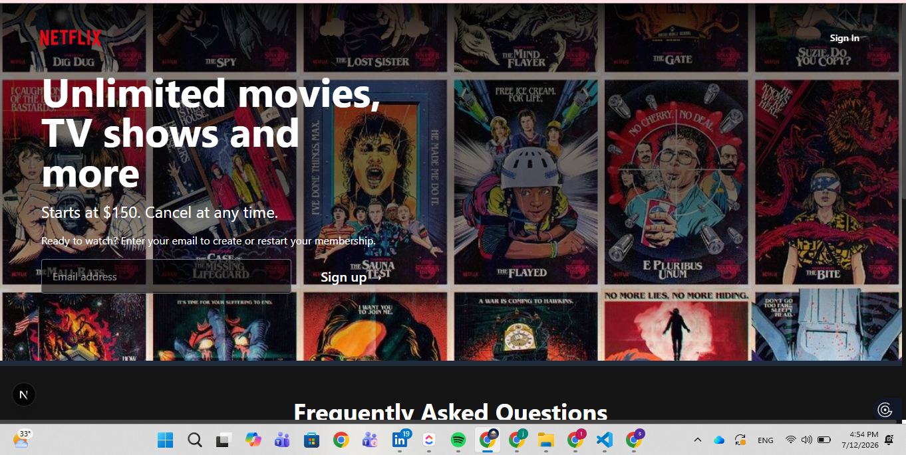
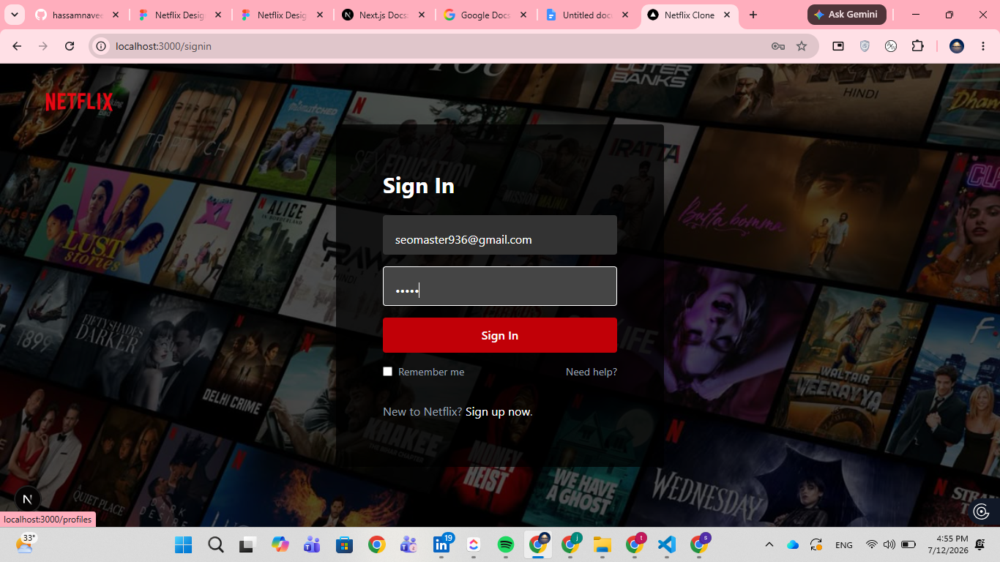
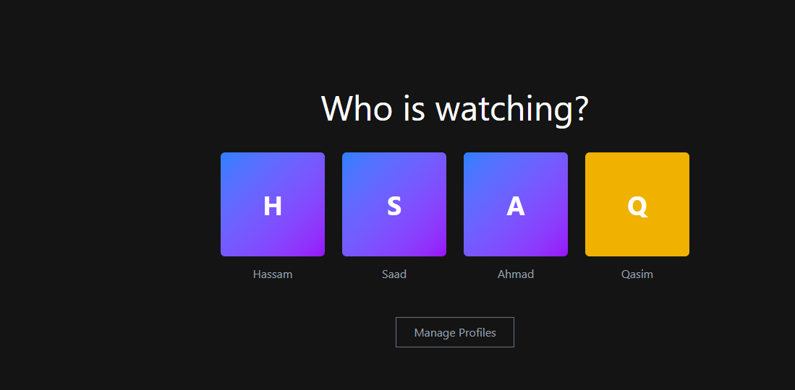
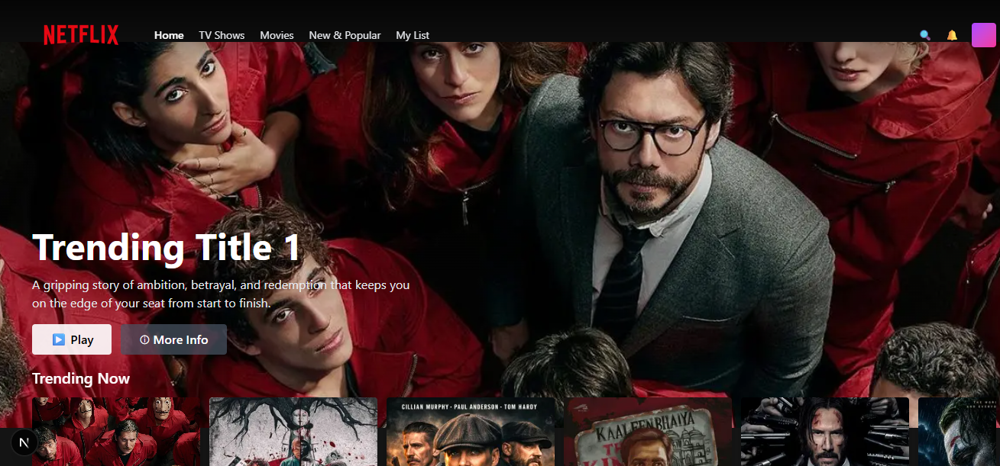
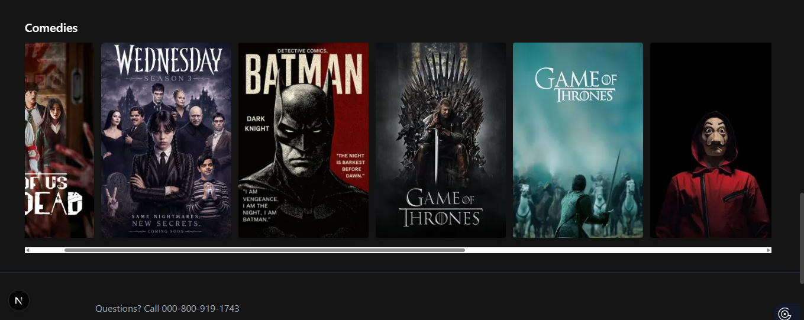
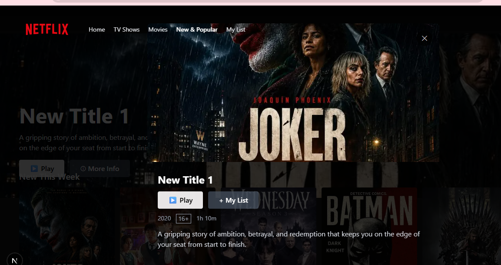

# Mobile Screenshots
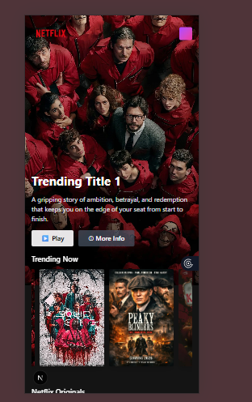
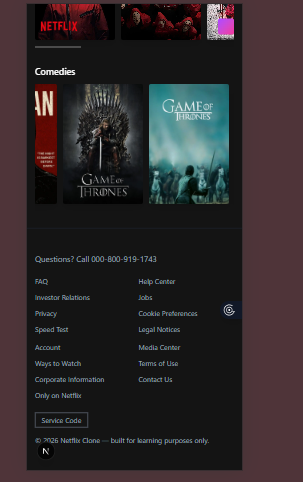
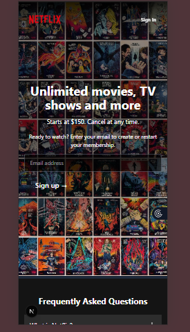
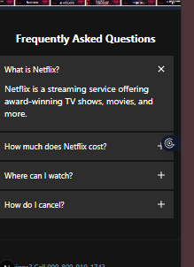
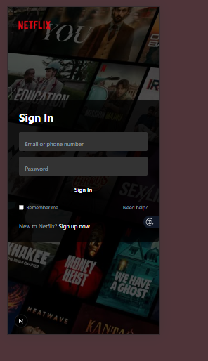
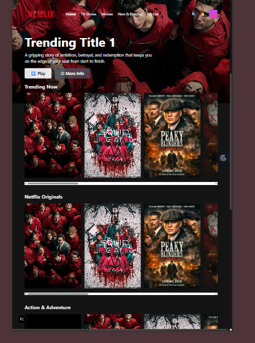
